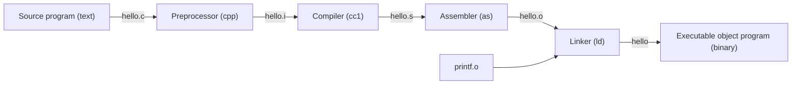

```c
#include <stdio.h>
int main() {
    printf("Hello, World!\n");
    return 0;
}
```

```text
#  i   n   c  l   u   d   e   SP <  s   t   d   i   o   .  h   >  LF
35 105 110 99 108 117 100 101 32 60 115 116 100 105 111 46 104 62 10
i   n   t   SP m   a  i   n   (  )   SP  {  LF
105 110 116 32 109 97 105 110 40 41  32  123 10
... more lines ...

```

## 1.1 Information Is Bits + Context

Our hello program begins life as a source program (or source file) that the programmer creates 
with an editor and saves in a text file called hello.c. The source program is a sequence of bits, 
each with a value of 0 or 1, organized in 8-bit chunks called bytes.

The hello.c program is stored in a file as a sequence of bytes. Each byte has an integer value that 
corresponds to some character.

Files such as hello.c that consist exclusively of ASCII characters are known as text files. 
All other files are known as binary files.

The representation of hello.c illustrates a fundamental idea: All information in a system—including 
disk files, programs stored in memory, user data stored in memory, and data transferred 
across a network—is represented as a bunch of bits. The only thing that distinguishes different data objects is 
the context in which we view them.

As programmers, we need to understand machine representations of numbers because 
they are not the same as integers and real numbers. They are finite approximations that can behave in unexpected ways. 
This fundamental idea is explored in detail in Chapter 2.


The hello program begins life as a high-level C program because it can be read and understood by human beings in that form. 
However, in order to run hello.c on the system, the individual C statements must be translated by other programs 
into a sequence of low-level machine-language instructions. These instructions are then packaged in a form 
called an executable object program and stored as a binary disk file. Object programs are also referred to as executable object files. 
On a Unix system, the translation from source file to object files is performed by a compiler driver:


